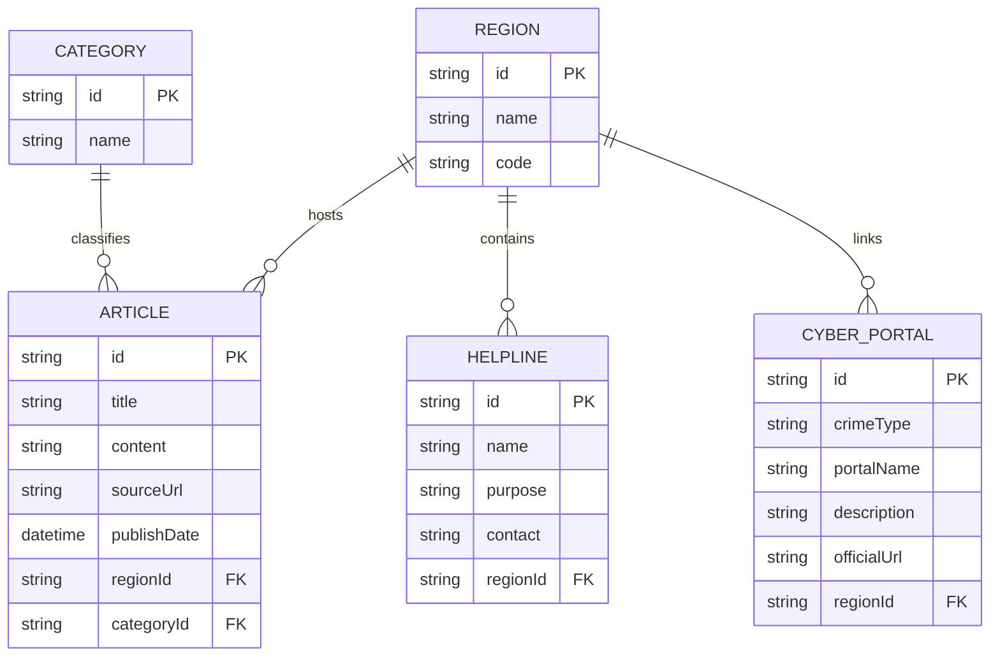

# UCRIP - Unified Cyber Resource Intelligence Platform

UCRIP is a production-grade, which is highly specialized cybercrime intelligence platform designed for government agencies and enterprise security teams. It transforms raw cybersecurity data from official national sources (CISA, CERT-In, NCSC, CERT-Bund) into a high-fidelity, actionable "Cyber-Noir" command center.


## 🏛️ 100% Official Intelligence Sources
Unlike generic aggregators, UCRIP strictly enforces a "Zero Third-Party" data policy. All advisories are ingested from verified government portals:

*   **🇮🇳 India (CERT-In)**: Powered by a custom **Cheerio-based scraping engine** that bypasses bot detection to fetch official Technical Bulletins (CIAD/CIVN alerts).
*   **🇺🇸 USA (CISA)**: Direct integration with official Alerts and Industrial Control Systems (ICS) feeds.
*   **🇬🇧 UK (NCSC)**: Full synchronization with the National Cyber Security Centre threat advisory network.
*   **🇩🇪 Germany (BSI / CERT-Bund)**: Automated ingestion of German national security bulletins.
*   **🇭🇰 Hong Kong (HKCERT)**: Integrated official HKCERT advisories and law enforcement reporting portals.
*   **Data Integrity**: 100% of legacy data from commercial news sites (`thehackernews.com`) has been purged to ensure a pure, high-trust environment.

## 🌟 Tactical Defense Features

*   **Cyber-Noir Opaque Dashboard**: A premium, high-impact tactical interface utilizing opaque command-center surfaces for maximum text contrast and visual authority.
*   **High-Fidelity 3D Tactical Globe**: 
    - **Digital Point Cloud**: Continents rendered as glowing cyan data points for a "Satellite Recon" aesthetic.
    - **Dynamic Coordinate Sync**: Threat markers are no longer hardcoded; they are mathematically plotted against a 250+ country lat/lon matrix. 
    - **Auto-Facing Precision**: The globe rotates instantly to face selections (India, HK, USA, etc.) with smooth-interpolation easing.
*   **CyberGuide Assistant 2.0**: A re-engineered 2-way empathetic dialog system (Gemini API) utilizing full session memory. It acts as a triage captain, querying users for incident specifics before outputting verified regional portal links. Supports rich Markdown and **Full-Screen Triage Mode**.
*   **Incidence Response Guides**: Built-in tactical playbooks for rapid response to Phishing, Ransomware, and payment fraud, formatted for high-pressure situations.
*   **Regional Helpline Intelligence**: Dynamically switches emergency contacts (e.g., **1930** for India, **+852 8105 6060** for HK) based on the active tactical theater.

## 🛠 Tech Stack

*   **Frontend**: Next.js 14+ (App Router), Tailwind CSS, Framer Motion, Three.js (@react-three/fiber), React Markdown, Recharts.
*   **Backend**: Node.js, Express, TypeScript, Node-Cron, Cheerio (Production Scraping), RSS-Parser.
*   **Database**: Prisma ORM with SQLite (Architected for seamless PostgreSQL scaling).

---

## 🚀 Presentation Setup

### 1. Intelligence Engine (Backend)
```bash
cd server
npm install

# Configure .env
# GEMINI_API_KEY=your_key
# DATABASE_URL="file:./dev.db"

# Synchronize Database
npx prisma db push
npm run seed

# Trigger Force-Sync of Official Data
# This will run the India (CERT-In), US (CISA), UK (NCSC), DE (BSI), and HK (HKCERT) fetchers
npx ts-node run-scraper.ts

# Launch Operations Center
npm run dev
```

### 2. Situational Awareness (Frontend)
```bash
cd client
npm install

# Port 3000 will host the Tactical Dashboard
npm run dev
```

Open `http://localhost:3000` to access the Command Center. Select **Hong Kong (HK)** or **India (IN)** from the sidebar to observe the 3D globe's automated vector targeting and regional data synchronization.

---

## 📊 Database Architecture



---

## ⚖️ Operational Integrity
1.  **Official Source Priority**: The platform serves as a unified lens for official government intelligence only.
2.  **Privacy by Design**: No PII (Personally Identifiable Information) is requested or stored.
3.  **Ethical Data Ingestion**: Automated fetchers respect government infrastructure via intelligent interval polling and calibrated headers.

---

## 🛡️ Cyber Warrior Program | DeepCytes Cyber Labs (UK)

### Program Attribution & Disclaimer
This repository was created as part of the Cyber Warrior Program conducted by **DeepCytes Cyber Labs (UK)**.
The Cyber Warrior Program is an educational and mentorship-driven initiative focused on:
*   AI literacy
*   Cybersecurity awareness
*   Ethical research practices
*   Responsible use of emerging technologies

All work contained in this repository is produced solely for educational and research purposes.

### Legal & Ethical Notice
*   No confidential, proprietary, or classified information was used.
*   No malicious intent, exploitation, or unlawful activity is endorsed or performed.
*   AI-generated outputs are experimental and may be incomplete or inaccurate.
*   The responsibility for interpretation and usage of this content lies with the contributor.

**DeepCytes Cyber Labs (UK)** and its affiliates:
*   Do not guarantee the accuracy of AI-generated content
*   Are not liable for misuse of any information contained herein
*   Do not endorse deployment of this work in production or offensive environments

### Mentorship & Attribution
This repository is published under mentorship provided through the Cyber Warrior Program by **DeepCytes Cyber Labs (UK)**.
The purpose of public publication is:
*   Skill demonstration
*   Transparent learning
*   Knowledge sharing within ethical and legal boundaries

© DeepCytes Cyber Labs (UK). All rights reserved.
