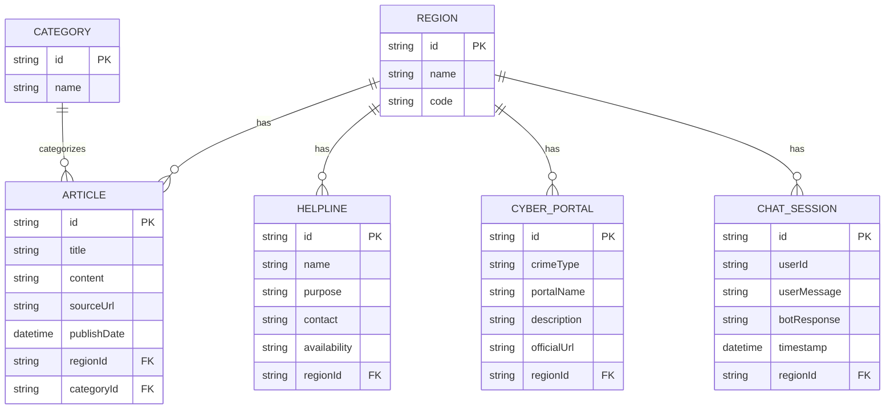

# UCRIP - Unified Cyber Resource Intelligence Platform

UCRIP is a production-ready, region-aware cybercrime intelligence platform. It aggregates official helplines, reporting portals, and cyber advisories on a premium, state-of-the-art dashboard built for rapid incident response and threat awareness.

 <!-- Update this link with a screenshot later if needed -->

## 🌟 Features

*   **Cyber-Noir Tactical UX/UI**: A premium, high-trust visual design featuring interactive glassmorphism, dynamic data grids, and neon typography for an immersive user experience.
*   **3D Threat Globe Centerpiece**: A dynamic, interactive 3D globe powered by Three.js and React Three Fiber, visualizing active monitoring regions with atmospheric and particle effects.
*   **Region-Aware Architecture**: Dynamically filters content and stats for active coverage areas (India, USA, Germany, UK, etc.).
*   **AI Chatbot (CyberGuide AI)**: Integrated with the Gemini AI API to provide region-specific guidance and empathy for cybercrime victims. Features full markdown support for readable, structured advice and a maximized immersive chat mode.
*   **Real-time RSS Threat Feed Engine**: Automated backend scheduler uses Node-Cron to fetch the latest advisories directly from official government feeds (like CISA, NCSC, CERT-In).
*   **Dynamic Response Guides**: Actionable, mobile-optimized incident response checklists for common cyber attacks (Ransomware, Phishing, UPI Fraud).
*   **Helplines & Official Portals Module**: Instantly provides emergency contact numbers and valid crime reporting forms based on the user's localized region.

## 🛠 Tech Stack

*   **Frontend**: Next.js 14+ (React), Tailwind CSS, Framer Motion, Three.js (@react-three/fiber), React Markdown, Recharts, Lucide Icons.
*   **Backend**: Node.js, Express, TypeScript, Node-Cron, RSS-Parser, Google GenAI SDK.
*   **Database**: Prisma ORM with SQLite (easily translatable to PostgreSQL).

---

## 🚀 Getting Started

### Prerequisites
*   Node.js (v18+)
*   npm or yarn
*   A Gemini API Key (for the chatbot)

### 1. Database & Backend Setup
```bash
cd server
npm install

# Set up environment variables
cp .env.example .env

# Configure .env with your settings:
# JWT_SECRET=your_super_secret_key
# GEMINI_API_KEY=your_gemini_api_key

# Push schema to the database
npx prisma db push

# Seed the database with Core Data
npm run seed

# Execute initial scrape for all regions
npx ts-node force-all-scrape.ts

# Start the Express server & Cron Scheduler (runs on Port 5000)
npm run dev
```

### 2. Frontend Setup
```bash
cd client
npm install

# Set up environment variables
cp .env.example .env.local
# Ensure NEXT_PUBLIC_API_URL=http://localhost:5000/api

# Start the Next.js development server (runs on Port 3000)
npm run dev
```

Open `http://localhost:3000` in your browser.

---

## 📊 Database Architecture



---

## 🤖 Chatbot Sequence Architecture (RAG)

1.  **User Input**: User interacts with the floating, markdown-enabled chatbot on the frontend.
2.  **Request Construction**: The Next.js client captures the selected Region (e.g., "India") and passes it to the backend.
3.  **Context Injection**: The Express server looks up the exact region in the DB, retrieving curated, real-world *Helplines* and *Cyber Portals* specific to that zone.
4.  **Prompt Assembly**: The server constructs a system prompt injected with the DB context.
5.  **Gemini AI Generation**: The dynamically enriched prompt is resolved by the Google Gemini API.
6.  **Response Render**: The frontend parses the structured markdown response in an immersive UI. 

---

## ⚖️ Ethical & Privacy Disclaimer

1.  **Informational Purposes Only**: This platform aggregates publicly available official resources. It is not a substitute for formal legal or law enforcement advice.
2.  **No PII Stored**: The chat logs store inputs and outputs for AI model improvement/analytics, but do not request, process, or permanently store Personally Identifiable Information (PII) like names or SSNs during standard usage.
3.  **Ethical Scraping**: The background RSS scraper strictly adheres to `robots.txt` rules, only targets explicit public RSS XML endpoints, and utilizes interval tracking to respect the infrastructure of official government sites.
