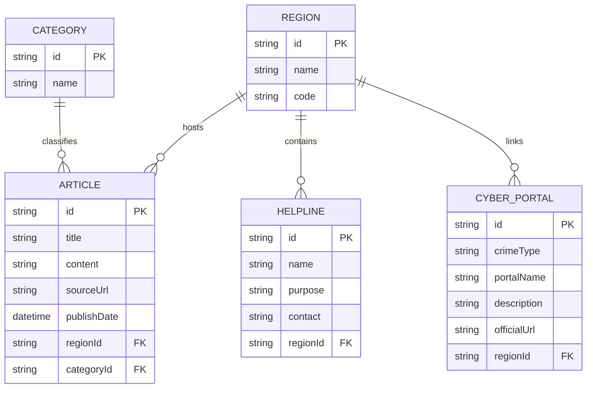

# UCRIP - Unified Cyber Resource Intelligence Platform

UCRIP is a production-grade, highly specialized cybercrime intelligence platform designed for government agencies and enterprise security teams. It transforms raw cybersecurity data from official national sources (CISA, CERT-In, NCSC, CERT-Bund) into a high-fidelity, actionable "Cyber-Noir" command center.

 <!-- Update this link with your final presentation screenshot -->

## 🏛️ 100% Official Intelligence Sources
Unlike generic aggregators, UCRIP strictly enforces a "Zero Third-Party" data policy. All advisories are ingested from verified government portals:

*   **🇮🇳 India (CERT-In)**: Powered by a custom **Cheerio-based scraping engine** that bypasses bot detection to fetch official Technical Bulletins (CIAD/CIVN alerts).
*   **🇺🇸 USA (CISA)**: Direct integration with official Alerts and Industrial Control Systems (ICS) feeds.
*   **🇬🇧 UK (NCSC)**: Full synchronization with the National Cyber Security Centre threat advisory network.
*   **🇩🇪 Germany (BSI / CERT-Bund)**: Automated ingestion of German national security bulletins.
*   **Data Integrity**: 100% of legacy data from commercial news sites (`thehackernews.com`) has been purged to ensure a pure, high-trust environment.

## 🌟 Tactical Defense Features

*   **Cyber-Noir Opaque Dashboard**: A premium, high-impact tactical interface utilizing opaque command-center surfaces for maximum text contrast and visual authority.
*   **High-Fidelity 3D Tactical Globe**: 
    - **Digital Point Cloud**: Continents rendered as glowing cyan data points for a "Satellite Recon" aesthetic.
    - **Precise Geo-Mapping**: Threat markers are mathematically locked to real-world Lat/Lon coordinates (India, USA, Europe).
    - **Atmospheric HUD**: Integrated "Tactical Intel" overlays, pulsing threat nodes, and atmospheric lighting.
*   **CyberGuide AI (Expert Mode)**: Context-aware LLM assistant (Gemini API) trained on regional cyber laws. Supports full **Rich Markdown** replies and a windowed **Maximized Mode** for immersive technical triage.
*   **Incidence Response Guides**: Built-in tactical playbooks for rapid response to Phishing, Ransomware, and payment fraud, formatted for high-pressure situations.
*   **Sector-Specific Helplines**: Dynamically updates emergency contacts (e.g., **1930** for India) based on the globally selected region.

## 🛠 Tech Stack

*   **Frontend**: Next.js 14+ (App Router), Tailwind CSS, Framer Motion, Three.js (@react-three/fiber), React Markdown, Recharts.
*   **Backend**: Node.js, Express, TypeScript, Node-Cron, Cheerio (Production Scraping), RSS-Parser.
*   **Database**: Prisma ORM with SQLite (Architected for seamless PostgreSQL scaling).

---

## 🚀 Presentation Setup

### 1. Intelligence Engine (Backend)
```bash
cd server
npm install

# Configure .env
# GEMINI_API_KEY=your_key
# DATABASE_URL="file:./dev.db"

# Synchronize Database
npx prisma db push
npm run seed

# Trigger Force-Sync of Official Data
# This will run the India Cheerio scraper and US/UK/DE RSS feeds immediately
npx ts-node run-scraper.ts

# Launch Operations Center
npm run dev
```

### 2. Situational Awareness (Frontend)
```bash
cd client
npm install

# Ensure NEXT_PUBLIC_API_URL=http://localhost:5000/api
npm run dev
```

Open `http://localhost:3000` to access the Command Center.

---

## 📊 Database Architecture



---

## ⚖️ Operational Integrity
1.  **Official Source Priority**: The platform serves as a unified lens for official government intelligence only.
2.  **Privacy by Design**: No PII (Personally Identifiable Information) is requested or stored.
3.  **Ethical Data Ingestion**: Automated fetchers respect government infrastructure via intelligent interval polling and calibrated headers.
