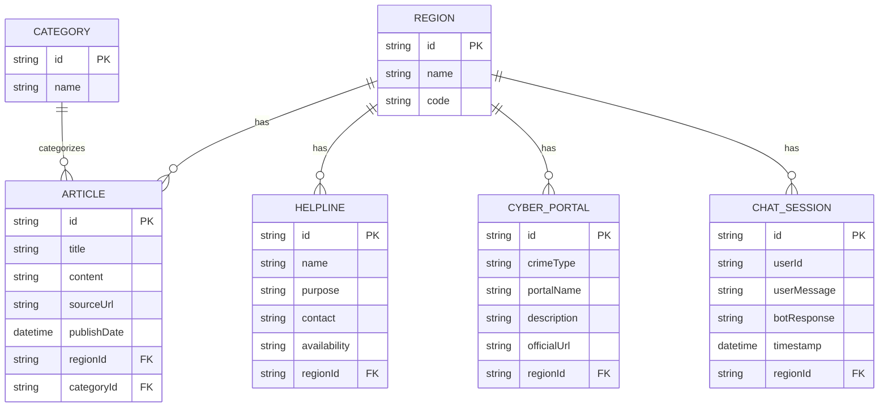

# UCRIP - Unified Cyber Resource Intelligence Platform

UCRIP is a production-ready, region-aware cybercrime intelligence platform. It aggregates official helplines, reporting portals, and cyber advisories, and provides an AI-powered chatbot to guide users.

## 🌟 Features
*   **Region-Aware Architecture**: Dynamically filters content (India, USA, Germany, Estonia).
*   **Advisories & Cases**: Aggregates government advisories and cybercrime educational content.
*   **Helplines Module**: Provides emergency contact numbers based on the user's selected region.
*   **Reporting Portals**: Maps specific crime types (phishing, financial fraud, etc.) to official government reporting portals.
*   **AI Chatbot (CyberGuide AI)**: Integrated with the Gemini API to provide region-specific guidance and empathy for cybercrime victims.
*   **Central Dashboard**: Visualizes platform data using Recharts (pie/bar charts).
*   **Automated Scheduler**: Uses Node-Cron for periodic tasks (RSS feed scraping, helpline validation).
*   **Secure Admin Panel**: JWT-based authentication with rate limiting.

## 🛠 Tech Stack
*   **Frontend**: Next.js (React), Tailwind CSS, Recharts, Axios
*   **Backend**: Node.js, Express, TypeScript, Node-Cron, Google GenAI SDK
*   **Database**: PostgreSQL (Prisma ORM)

---

## 🚀 Getting Started

### Prerequisites
*   Node.js (v18+)
*   npm or yarn
*   A Gemini API Key (for the chatbot)

### 1. Database & Backend Setup
```bash
cd server
npm install

# Set up environment variables
cp .env.example .env

# Configure .env with your settings:
# JWT_SECRET=your_super_secret_key
# GEMINI_API_KEY=your_gemini_api_key

# Push schema to SQLite (or Postgres if configured)
npx prisma db push

# Seed the database with India, USA, Germany, and Estonia data
npm run seed

# Start the Expres server (runs on Port 5000)
npm run dev
```

### 2. Frontend Setup
```bash
cd client
npm install

# Set up environment variables
cp .env.example .env.local
# Make sure NEXT_PUBLIC_API_URL=http://localhost:5000/api

# Start the Next.js development server (runs on Port 3000)
npm run dev
```

Open `http://localhost:3000` in your browser.

---

## 📊 Database Schema (ER Diagram)



---

## 🌐 REST API Endpoints

### Public Endpoints
| Endpoint | Method | Params/Query | Description |
| :--- | :--- | :--- | :--- |
| `/api/regions` | GET | - | Returns all available regions |
| `/api/dashboard/stats` | GET | `?regionCode=IN` | Returns dashboard statistics (counts, charts data) |
| `/api/advisories` | GET | `?regionCode=IN&categoryId=...` | Returns articles filtered by region |
| `/api/helplines` | GET | `?regionCode=IN` | Returns emergency helplines for a region |
| `/api/portals` | GET | `?regionCode=IN` | Returns official reporting portals for a region |
| `/api/chat` | POST | `{ message, regionCode }` | Sends query to Gemini AI with injected context |

### Protected Endpoints (Requires JWT)
| Endpoint | Method | Body | Description |
| :--- | :--- | :--- | :--- |
| `/api/admin/login` | POST | `{ email, password }` | Authenticates admin and returns JWT |
| `/api/helplines` | POST | `HelplineData` | Creates a new helpline |
| `/api/helplines/:id` | PUT | `HelplineUpdate` | Updates a helpline and logs the change |
| `/api/portals` | POST | `PortalData` | Creates a new reporting portal |
| `/api/advisories` | POST | `ArticleData` | Manually adds an advisory |

---

## 🤖 Chatbot Sequence Flow

1.  **User Input**: User opens the floating chatbot on the frontend and types a message (e.g., "I was scammed online").
2.  **Request Construction**: The Next.js client captures the selected Region (e.g., "India") and sends `message` and `regionCode` to `/api/chat`.
3.  **Context Injection**: The Express server looks up the region in the DB, fetching relevant *Helplines* and *Cyber Portals* for that specific region.
4.  **Prompt Engineering**: The server prepends the retrieved DB context to the user's prompt as system instructions:
    *   *"You are CyberGuide AI... The user is in **India**. Active helplines: **1930 / 181**. Relevant reporting portals: **cybercrime.gov.in**..."*
5.  **Gemini API Call**: The augmented prompt is sent to Google's Gemini API.
6.  **Response Generation**: Gemini acts empathetically and accurately based *only* on the injected context.
7.  **Logging**: The backend logs the user input and bot response into the database for analytics.
8.  **Output**: The bot's response is sent back to the client and rendered in the UI.

---

## ⚖️ Ethical & Privacy Disclaimer

1.  **Informational Purposes Only**: This platform aggregates publicly available official resources. It is not a substitute for formal legal or law enforcement advice.
2.  **No PII Stored**: The chat logs store inputs and outputs for AI model improvement/analytics, but do not request, process, or permanently store Personally Identifiable Information (PII) like names or SSNs during standard usage.
3.  **Ethical Scraping**: The background RSS scraper strictly adheres to `robots.txt` rules and standard rate-limiting practices to respect the infrastructure of official government sites.
